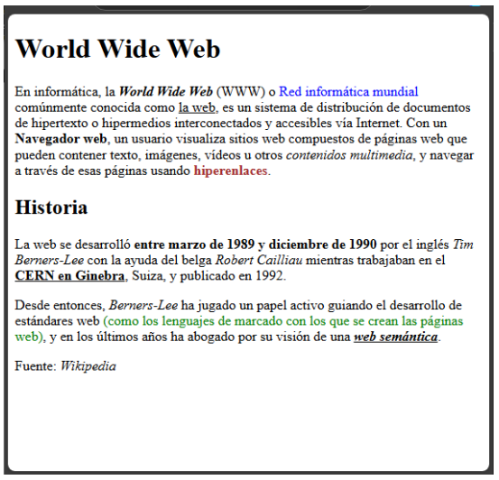
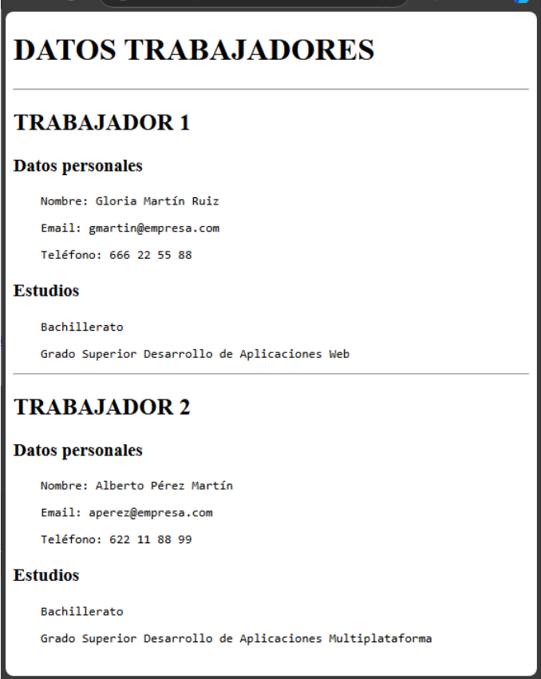

# EJERCICIOS HTML LENGUAJE DE MARCAS

## EJERCICIO 1

A continuación, se te presenta un documento web con algunos errores de sintaxis y a nivel de
estructura del documento web, corrígelos.

```html
<DOCTYPE html>
<html>
    <head>
        </meta charset="utf-8">
        <meta name="description" content="Ejercicio HTML - Corrige los errores">

    <body>
    </head>
        <title>Corrige los errores que encuenres en el documento</title>

    <h1>Aprender HTML es muy divertido</h1>
    <p>Lorem ipsum dolor sit amet, consectetur adipisicing elit. Molestiae quam optio nesciuntatque iure animi dicta velit

    <p>Lorem ipsum dolor sit amet, consectetur adipisicing elit. Molestiae quam optio nesciuntatque iure animi dicta velit</p>
</body>
    <p>Lorem ipsum dolor sit amet, consectetur adipisicing elit. Molestiae quam optio nesciuntatque iure animi dicta velit</p>
<html> 

```

1. En la primera línea al `DOCTYPE` le falta delante un `!` por lo que bién escrito sería `!DOCTYPE`.

2. En la cuarta línea no se escribe `/meta` se escribe `meta` sin la `/`

3. En la séptima línea donde está el `<body>` debería estar primero el `</head>` y una vez cerrado el `<head>` si se puede poner abrir el `<body>`

4. En la onceava línea se abre un `<p>` pero nunca llega a cerrase con un `</p>` por lo que esto es un error.

5. En la catorceava línea no puedes cerrar el `<body>` y luego abrir otro parrafo con `<p>` + `</p>`.

6. En la última línea no se ha cerrado el `<html>` correctamente, se debe cerrar con un `/` como en este ejemplo: `</html>`

---

## EJERCICIO 2

Crea una página webcon el siguiente texto formateado talcual puedes ver en la imagen de la derecha.

En este ejercicio no debes usar CSS.



Este es mi código del html hecho  -> [Ejercicio2.html](src/ejercicio2.html)

---

## EJERCICIO 3

De cara a tener información de todos los empleados de una empresa en su intranet se necesitan ciertos datos en formato HTML. Los datos a incluir son: 

- Nombre

- Estudios

- Email

El documento HTML que crees debe incluir:

- Estructura completa de un documento HTML. 

- Comentarios

- Etiquetas H1, H2 y H3

- Uso de `<div>` para agrupar los trabajadores y dentro otros `<div>` para agrupar los datos personales y estudios

- Uso de `<pre>` para alinear la información (no usar listas todavía).

El documento debe quedar como el de la imagen de abajo.

En este ejercicio no debes usar CSS.



Este es mi código del html hecho  -> [Ejercicio3.html](src/ejercicio3.html)